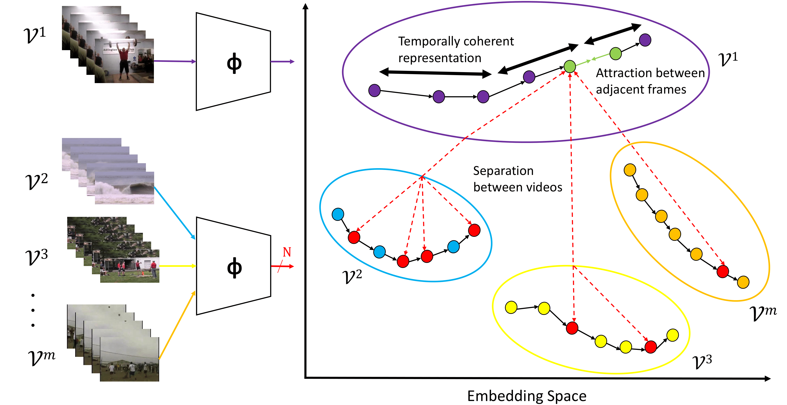
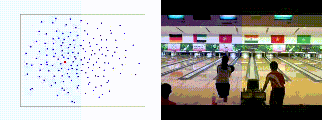
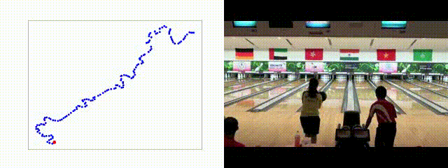
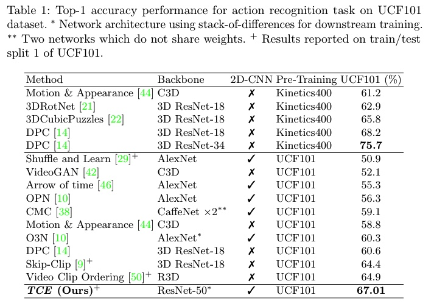

## [Joshua Knights]() and [Anthony Vanderkop]() and [Daniel Ward](https://danielcward.github.io/) and [Olivia Mackenzie-Ross]() and [Peyman Moghadam](https://people.csiro.au/m/p/peyman-moghadam)

This is the webpage for the paper: Temporally Coherent Embeddings for Self-Supervised Video Representation Learning

## [[ Paper ]](https://arxiv.org/abs/2004.02753) [[Code & Pre-trained Models]](https://github.com/csiro-robotics/TCE) [[ BibTex ]](docs/TCE2020.bib)

# Abstract
<div style="text-align: justify"> 
This paper presents __TCE: Temporally Coherent Embeddings__ for self-supervised video representation learning. The proposed method exploits inherent structure of unlabeled video data to explicitly enforce temporal coherency in the embedding space, rather than indirectly learning it through ranking or predictive pretext tasks.  In the same way that high-level visual information in the world changes smoothly, we believe that nearby frames in learned representations should demonstrate similar properties. Using this assumption, we train the __TCE__ model to encode videos such that adjacent frames exist close to each other and videos are separated from one another. Using __TCE__ we learn robust representations from large quantities of unlabeled video data. We evaluate our self-supervised trained __TCE__ model by adding a classification layer and finetuning the learned representation on the downstream task of video action recognition on the UCF101 dataset. We obtain 67.01% accuracy and outperform the state-of-the-art self-supervised methods trained on UCF101 despite using a significantly smaller dataset for pre-training. Notably, we demonstrate results competitive with more complex 3D-CNN based networks while training with a 2D-CNN network backbone on action recognition tasks. </div> 

Our training code and pretrained models are available at [github.com/csiro-robotics/TCE](https://github.com/csiro-robotics/TCE).
# Model
<div style="margin:0 auto">  </div>

# Results
## Qualitative
### Random Weights
<div style="margin:0 auto">  </div>

### Imagenet Pre-Trained
<div style="margin:0 auto">  </div>

### TCE
<div style="margin:0 auto">  </div>

## Quantitative
For datasets pre-trained on the UFC101 dataset, we achieve state-of-the-art results and outperform the majority of approaches pre-trained on the much larger Kinetics400 dataset.
<div style="margin:0 auto">  </div>


# Citation
```
@misc{knights2020temporally,
    title={Temporally Coherent Embeddings for Self-Supervised Video Representation Learning},
    author={Joshua Knights and Anthony Vanderkop and Daniel Ward and Olivia Mackenzie-Ross and Peyman Moghadam},
    year={2020},
    eprint={2004.02753},
    archivePrefix={arXiv},
    primaryClass={cs.CV}
}
```