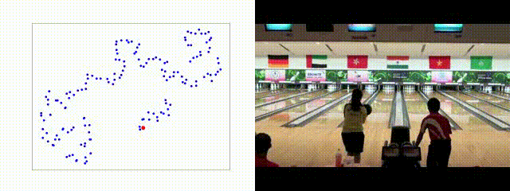

## [Joshua Knights]() and [Ben Harwood]()  and [Daniel Ward](https://danielcward.github.io/) and [Anthony Vanderkop]() and [Olivia Mackenzie-Ross]() and [Peyman Moghadam](https://people.csiro.au/m/p/peyman-moghadam)

This is the webpage for the paper: Temporally Coherent Embeddings for Self-Supervised Video Representation Learning

## [[ Paper ]](https://arxiv.org/abs/2004.02753) [[Code & Pre-trained Models]](https://github.com/csiro-robotics/TCE) [[ BibTex ]](docs/TCE2020.bib)

# Abstract
<div style="text-align: justify"> 
This paper presents TCE: Temporally Coherent
Embeddings for self-supervised video representation learning. The proposed method exploits inherent structure of unlabeled video data to explicitly enforce temporal coherency in the embedding space, rather than indirectly learning it through ranking or predictive proxy tasks. In the same way that high-level visual information in the world changes smoothly, we believe that nearby frames in learned representations will benefit from demonstrating similar properties. Using this assumption, we train our TCE model to encode videos such that adjacent frames exist close to each other and videos are separated from one another. Using TCE we learn robust representations from large quantities of unlabeled video data. We thoroughly analyse and evaluate our self-supervised learned TCE models on a downstream task of video action recognition using multiple challenging benchmarks (Kinetics400, UCF101, HMDB51). With a simple but effective 2D-CNN backbone and only RGB stream inputs, TCE pre-trained representations outperform all previous selfsupervised 2D-CNN and 3D-CNN pre-trained on UCF101.</div> 

Our training code and pretrained models are available at [github.com/csiro-robotics/TCE](https://github.com/csiro-robotics/TCE).
# Model
<div style="margin:0 auto">  </div>

# Results
## Qualitative
### Random Weights
<div style="margin:0 auto">  </div>

### Imagenet Pre-Trained
<div style="margin:0 auto">  </div>

### TCE
<div style="margin:0 auto">  </div>

## Quantitative
For datasets pre-trained on the UFC101 dataset, we achieve state-of-the-art results on both UCF101 and HMDB51 and outperform the majority of approaches pre-trained on the much larger Kinetics400 dataset.  When pre-training on Kinetics, we also achieve state-of-the-art results on HMDB51 for datasets pre-trained on Kinetics400.
<div style="margin:0 auto">  </div>


# Citation
```
@misc{knights2020tce,
    title={Temporally Coherent Embeddings for Self-Supervised Video Representation Learning},
    author={Joshua Knights and Anthony Vanderkop and Daniel Ward and Olivia Mackenzie-Ross and Peyman Moghadam},
    year={2020},
    eprint={2004.02753},
    archivePrefix={arXiv},
    primaryClass={cs.CV}
}
```
